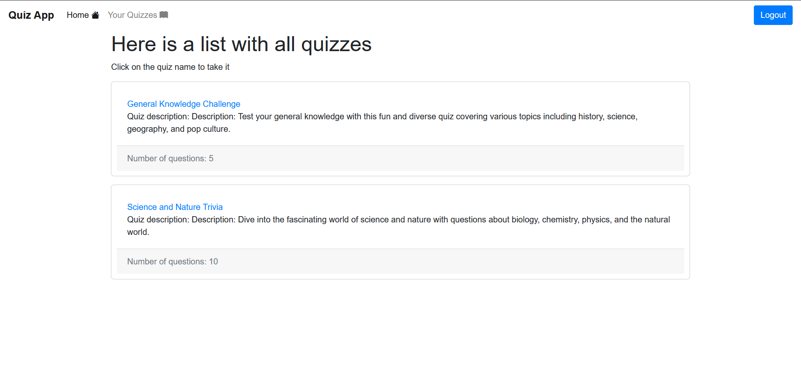

# Quiz App written in Django framework

A web-based application for creating, managing, and taking quizzes. Users can register, log in, create quizzes with multiple-choice questions, and participate in quizzes created by others.

[](https://skillicons.dev)

## Table of Contents

- [Demo](#demo)
- [Features](#features)
- [Installation](#installation)
- [Usage](#usage)
- [Contributing](#contributing)
- [License](#license)
- [Contact](#contact)

## Demo


## Features

- User authentication (login/register)
- Create quizzes with up to 4 answer choices per question
- View and participate in quizzes
- Responsive frontend design

## Installation

1. **Clone the repository:**

	```bash
	git clone https://github.com/AdelinCraciunesc/django_quiz_app
	cd quiz-app
	```

2. **Create and activate a virtual environment:**

	```bash
	python -m venv venv
	source venv/bin/activate  # On Windows use `venv\Scripts\activate`
	```

3. **Install the required dependencies:**

	```bash
	pip install -r requirements.txt
	```

4. **Run migrations:**

	```bash
	python manage.py migrate
	```

5. **Create a superuser:**

	```bash
	python manage.py createsuperuser
	```

6. **Run the development server:**

	```bash
	python manage.py runserver
	```

	The app will be available at `http://127.0.0.1:8000/`.

## Usage

1. **Register a new account or log in with an existing account.**
2. **Create a new quiz by navigating to the 'Your quizzes' page.**
3. **Add questions and answers to your quiz.**
4. **View and participate in quizzes created by other users.**

## Contributing

Contributions are welcome! Please follow these steps:

1. Fork the repository.
2. Create a new branch (`git checkout -b feature-branch`).
3. Make your changes.
4. Commit your changes (`git commit -m 'Add some feature'`).
5. Push to the branch (`git push origin feature-branch`).
6. Open a pull request.

## License

This project is licensed under the MIT License - see the [LICENSE](LICENSE) file for details.

## Contact

If you have any questions or suggestions, feel free to contact me:

- **Email**: adelin.craciunesc21@gmail.com
- **GitHub**: [AdelinCraciunesc](https://github.com/AdelinCraciunesc)
- **LinkedIn**: [Adelin Crăciunesc](https://www.linkedin.com/in/lascu-adelin-cr%C4%83ciunesc-a46a26212/)
